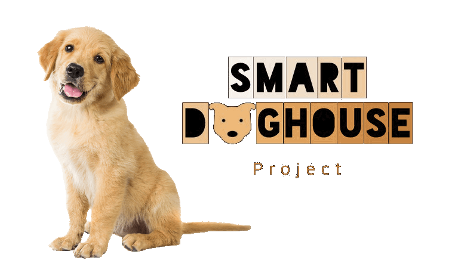
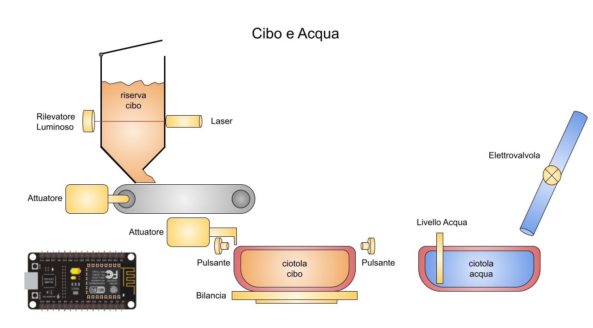

# SmartDogHouse-Software

CodeFactor: [](https://www.codefactor.io/repository/github/smartdoghouse/smartdoghouse-software)

Codacy: [](https://www.codacy.com/gh/SmartDogHouse/SmartDogHouse-Software/dashboard?utm_source=github.com&amp;utm_medium=referral&amp;utm_content=SmartDogHouse/SmartDogHouse-Software&amp;utm_campaign=Badge_Grade)

SonarCloud: [](https://sonarcloud.io/dashboard?id=SmartDogHouse_SmartDogHouse-Software)


## Overview
Automation of an animal shelter for SmartCity project. Using Domain-Driven-Design and Build Automation + Continuous-Integration/Continuous-Delivery.

This repo contains the code for the microcontrollers that automates the food and water delivery, tracks the consumptions and, optionally, the vital signs of the animal. 


## Setup Repository
- clone the repo or download the latest release
  ```bash
  git clone git@github.com:SmartDogHouse/SmartDogHouse-Software.git
  ```
 - if you want to send data to AWS, put your AWS __key__ and __cert__ in the folder "_flash_" under _src/main/python_,
they are used to identify your ESP to AWS.
 - substitute you WiFi SSID, Password and amazon host in file _main.py_ (either changing the strings either creating a module "_secret.py_ with the strings that won't be tracked)

you can find the documentation of the code at:
[https://smartdoghouse.github.io/SmartDogHouse-Software/documentation/src/](https://smartdoghouse.github.io/SmartDogHouse-Software/documentation/src/)

## Run Tests
If you want to run the tests of the code, inside project folder root execute
```bash
python -m src.test.python.test_water_sensor #single test
```
```bash
python -m unittest discover -s ./src/test/ #all tests
```
### with coverage report
#### you can find the coverage report updated for all branches at:
[https://smartdoghouse.github.io/SmartDogHouse-Software/](https://smartdoghouse.github.io/SmartDogHouse-Software/)

```bash
pip install coverage
```
Run tests with coverage:
```bash
coverage run -m src.test.python.test_water_sensor #single test
```
```bash
coverage run -m unittest discover -s ./src/test/ #all tests
```

create report and report website:
```bash
coverage report	        #report in shell
coverage html		#report website, open index.html in htmlcov folder
```

## INSTALLATION on Esp
### MICROPYTHON
 - Connect ESP32 (or a similar device)
 - check if you can see it with command ```ls /dev/ttyU*```

if using VirtualBox:
 - VirtualBox -> Settings -> Usb -> Add "Usb name of the ESP"
 - in Ubuntu (or the OS emulated), on the top: Devices -> Usb -> Select it


#### install esptool
```bash
sudo pip3 install esptool
```

 _If you want to skip the next 3 steps for installing the firmware, you can see the [bash scripts](#bash-scripts)_
#### esptool is used to flash the ESP's memory (press "BOOT" on ESP if stuck on "connecting..--....--..")
```bash
esptool.py --chip esp32 --port /dev/ttyUSB0 erase_flash
```

#### micropython is a python firmware for microcontrollers, download it 
```bash
wget https://micropython.org/resources/firmware/esp32-20210618-v1.16.bin
```

#### use esptool to flash it on the ESP
```bash
esptool.py --chip esp32 --port /dev/ttyUSB0 write_flash -z 0x1000 esp32-20210618-v1.16.bin
``` 
### AMPY: moving files to ESP
#### install Ampy, it's used to move files in the ESP (or to execute bash commands in it)
```bash
pip3 install adafruit-ampy
```
- #### (auto) if you want to use the code of the repo, use the [bash scripts](#bash-scripts) to upload the files
  #### _Remember to modify main.py with your WiFi's SSID & password, add cerficates and secrets._
- #### (manual) take the files you need from the repo, like a sensor or actuator.
  #### Move them inside with Ampy, es
  ```bash
  ampy -d 1 --port /dev/ttyUSB0 put src/main/python/boot.py
  ampy -d 1 --port /dev/ttyUSB0 put src/main/python/main.py
  ampy -d 1 --port /dev/ttyUSB0 put src/main/python/water_sensor.py
  ```
 _Careful! in the code folder there are some stubs that shouldn't be uploaded to your esp, 
 use the [bash scripts](#bash-scripts) in the folder if you want to upload the files of this project.
 Stubs are used to make the tests work with normal python installation_

### PICOCOM (reach the REPL of MicroPython in the ESP)
#### Picocom is used to watch output of the ESP and use micropython REPL in the ESP 
#### (esc with ctrl+a+x) (/!\ when it's open, it blocks Ampy) 
#### Launch Picocom to see the output of the program
```bash
picocom /dev/ttyUSB0 -b 115200
```
#### ctrl+c to access the REPL (when launched it executes the code in the ESP, ctrl+c interrupts it)

#### (optional) test working with python REPL example
```
from water_sensor import WaterSensor   # import a sensor

ws=WaterSensor(33)         # assign it to a pin

ws.measure()     # measure

ws.get_last_measure() 
```
#### IP of the ESP: press RST, wait "Connecting WiFi" and check the IP

### WebREPL
#### (optional) if you want to upload files while using the REPL, you can use this instead of Ampy
#### Clone WebREPL, it's used to move files like Ampy, but it doesn't get stuck if Picocom is open
```bash
git clone https://github.com/micropython/webrepl
```
#### Example to push file main.py (substitute also the IP)
```bash
./webrepl_cli.py -p cam ../main.py 192.168.1.208:/main.py
```

## BASH SCRIPTS
#### To fast-forward flashing memory and upload firmware on your ESP you can use
```bash
bash upload_firmware.sh
```

#### To fast-forward moving files in python folder to your ESP you can use
```bash
bash src/main/python/upload_folder_files.sh 
```
it is safe, it doesn't upload stub files like "machine.py", the stubs emulate the libraries of MicroPython 
and make the test-files work with normal python.

#### To fast-forward moving key and cert to your ESP you can use
```bash
bash src/main/python/flash/upload_key_cert.sh 
```

## License

This project is under a License - see the [LICENSE](LICENSE) file for details
